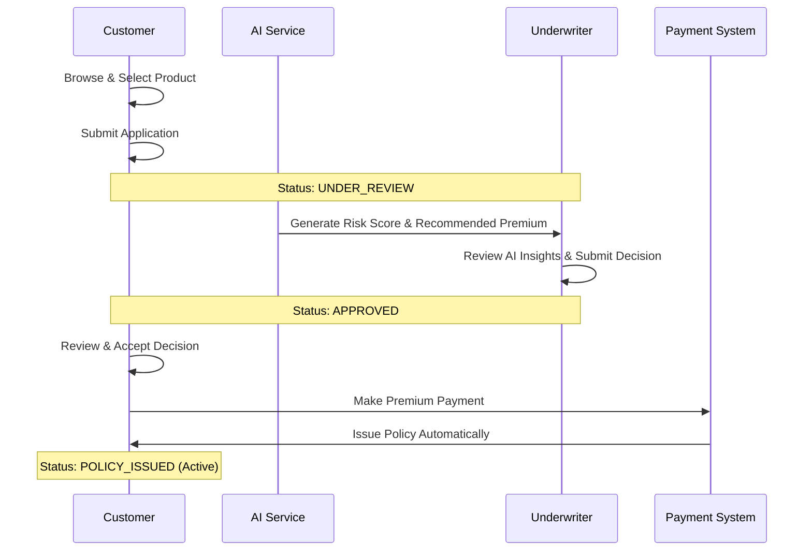
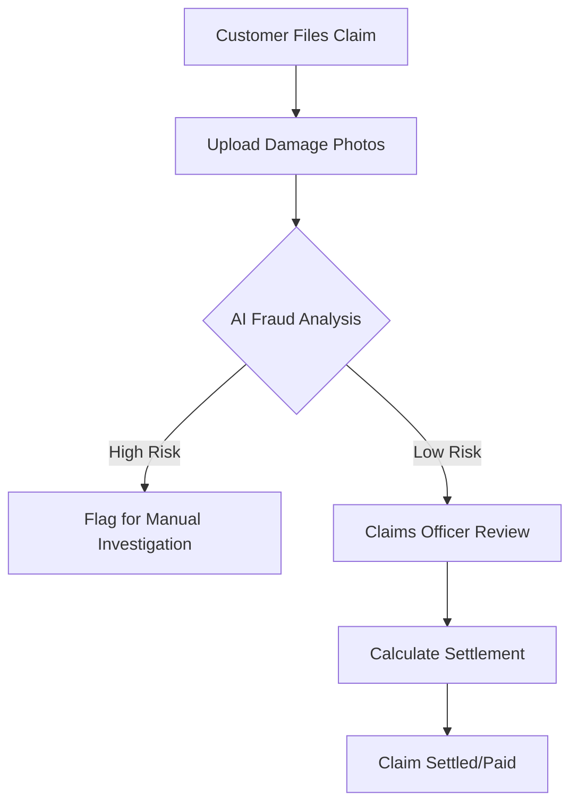

# B-SURE: Business Insurance Management System
## Stakeholder Presentation & Technical Overview

B-SURE is a modern, AI-integrated full-stack insurance platform designed to streamline the lifecycle of business insurance—from product discovery and application to underwriting, policy issuance, and claims management.

---

## 1. Core Platform Features

### For Customers (Policy Holders)
- **Product Discovery**: Browse various business insurance products (General Liability, Professional Indemnity, etc.) with detailed coverage information.
- **Dynamic Application Wizard**: A multi-step process to apply for insurance, tailored to the specific business profile.
- **Active Policy Portfolio**: View all active policies, coverage amounts, and renewal dates in one place.
- **Seamless Payments**: Integrated "Pay Now" workflow for approved applications to instantly activate policies.
- **Claims Portal**: File claims with incident descriptions and supporting documentation (photos/documents).
- **AI Policy Assistant**: A context-aware chatbot that answers questions about the user's specific policies and claims.

### For Underwriters (Risk Assessment)
- **Work Queue Management**: Dedicated queue for applications requiring review.
- **AI Risk Insights**: Receive AI-generated risk scores and recommended premium adjustments for every application.
- **Decision Engine**: Approve or reject applications with custom comments and premium loading/discounts.

### For Claims Officers (Operations)
- **Claims Review Queue**: Manage and process incoming claims.
- **AI Fraud Detection**: Automated analysis of claim details and damage photos to identify potential fraud or high-risk claims.
- **Settlement Workflow**: Calculate and approve settlement amounts dynamically.

### For Administrators (Management)
- **System-wide Analytics**: Real-time dashboard showing total revenue, active policies, and claim volumes.
- **User & Staff Management**: Control access levels for Customers, Underwriters, and Claims Officers.

---

## 2. Technical Architecture

B-SURE is built on a modern, scalable micro-architecture.

### Frontend: Angular 16+
- **Modular Design**: Feature-based architecture for easy scalability.
- **Reactive State**: Uses Angular Signals for high-performance UI updates and real-time dashboard statistics.
- **Premium UI**: Custom-styled design system with a professional "Burgundy & Cream" aesthetic.

### Backend: Spring Boot 3+ (Java)
- **RESTful API**: Secure and well-documented API endpoints for all business operations.
- **Spring AI Integration**: Deep integration with Google Cloud Vertex AI for advanced cognitive features.
- **Spring Security**: Robust JWT-based authentication and role-based access control (RBAC).

### Database: MySQL
- **Relational Schema**: Structured data management for Businesses, Products, Applications, Policies, and Claims.
- **ER Consistency**: Ensures data integrity across complex financial transactions.

### AI Integration: Google Vertex AI (Gemini 2.5 Flash)
- **Multimodal Processing**: Analyzes both text (claim descriptions) and images (damage photos).
- **Contextual Intelligence**: Chatbot is fed real-time data from the database to provide accurate, user-specific answers.

---

## 3. Core Business Workflows

### A. The Policy Issuance Lifecycle

### B. The Claims Management Flow

---

## 4. Why B-SURE Stands Out

1. **Efficiency**: AI automation reduces the time from application to policy issuance from days to minutes.
2. **Precision**: Multimodal AI analysis in claims detects fraud patterns that human reviewers might miss.
3. **Personalization**: The AI Chatbot acts as a 24/7 personal broker, knowing exactly what policies the user holds.
4. **Visibility**: Real-time role-specific dashboards provide every stakeholder with exactly the data they need to make decisions.

---

> [!NOTE]
> This document summarizes the current state of the B-SURE FullStack application as of March 2026. Data and features are subject to evolution as new AI models and business requirements are integrated.
